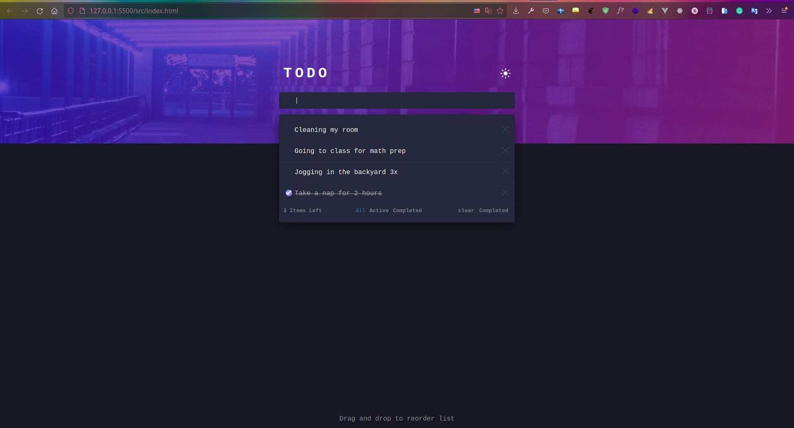
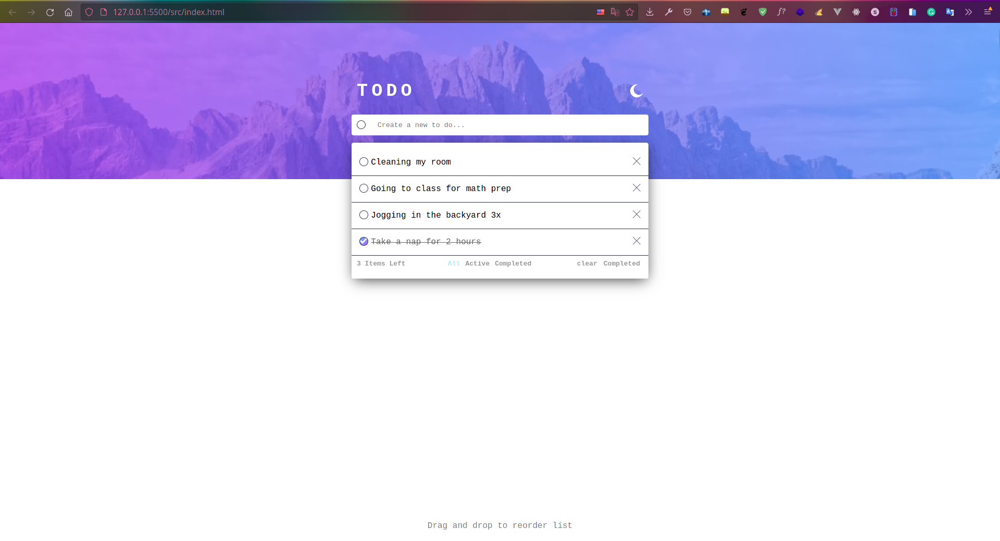
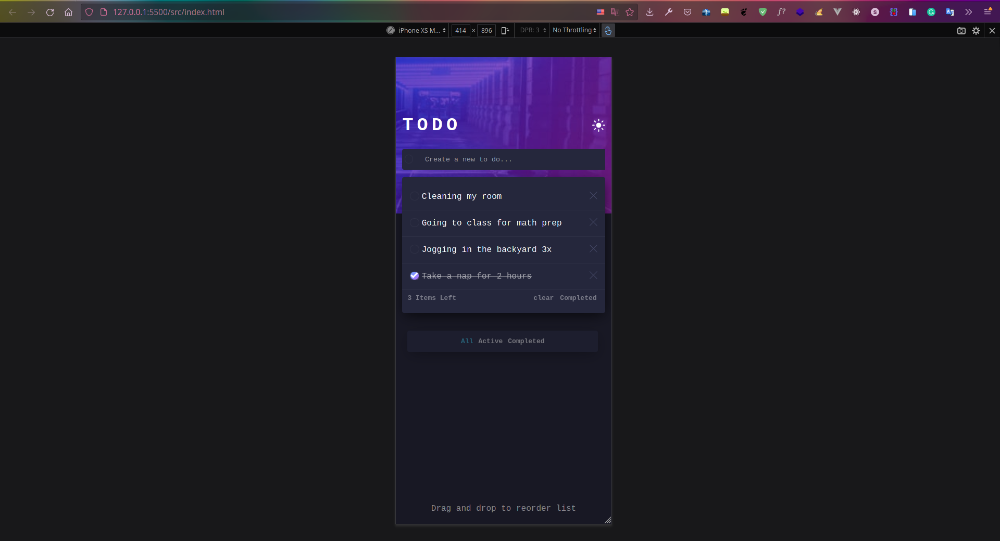
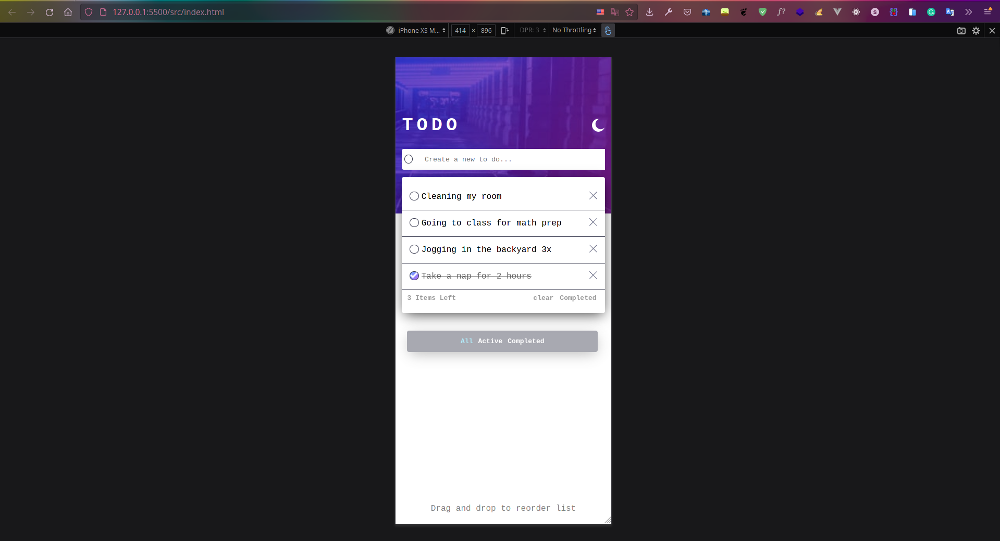

## Welcome! 👋
Welcome to my repo my name is Johnson i'm a full-stack software dev with a design backaground.

### About the Challenge
This is a fronted challenge to level up design skills from [frontend mentor](https://github.com/mukunzidd/todo-app-starter)

### Time taken 🕡 
- Dark mode: 72 Minutes
- Light mode: 17 Minutes
- Mobile: 30 Minutes
- Javascript: 3 Hours
- Debugging: 1 Hour 

### Live Testing
You can check it here on  [gh-pages](https://joshwambere.github.io/frontend-mentor-challenge/)
### Final product
#### Desktop Dark

#### Desktop Light

#### Mobile Dark

#### Mobile Light

